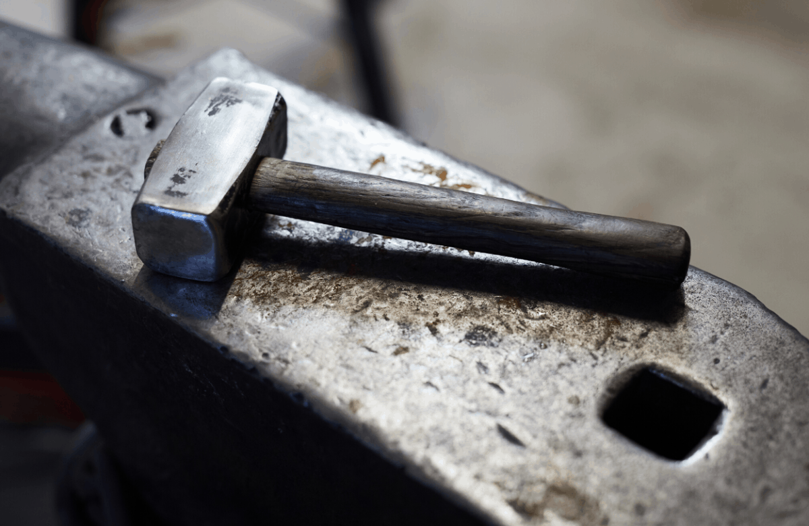

# `hammer`


Automatic mesh and toolpath generation for thermal simulations in additive manufacturing process

## Requirements

* most comes from 
	```bash
	pip install -r requirements.txt
	```


## Contact

* [Achez](jiangcechen@gmail.com)

